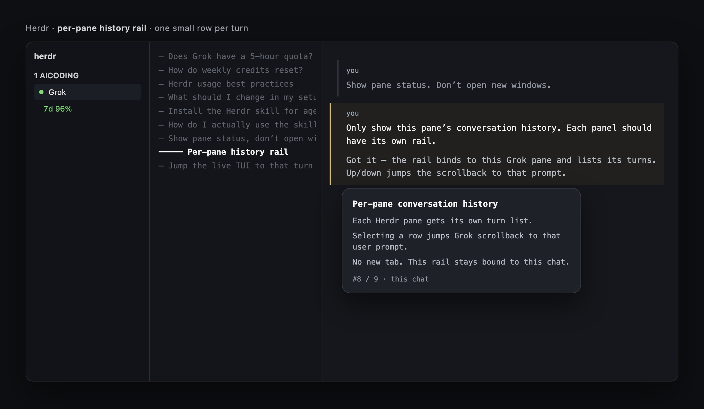
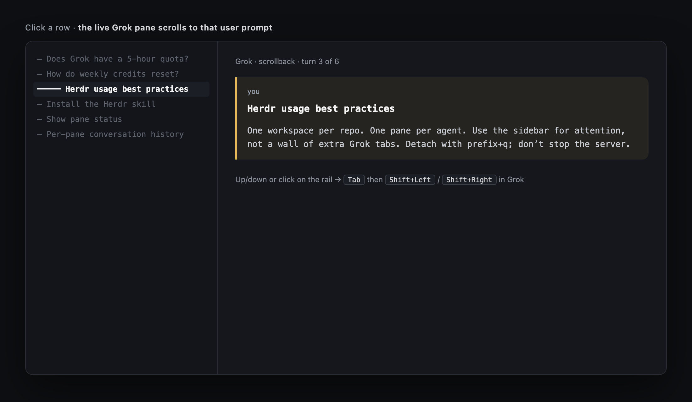
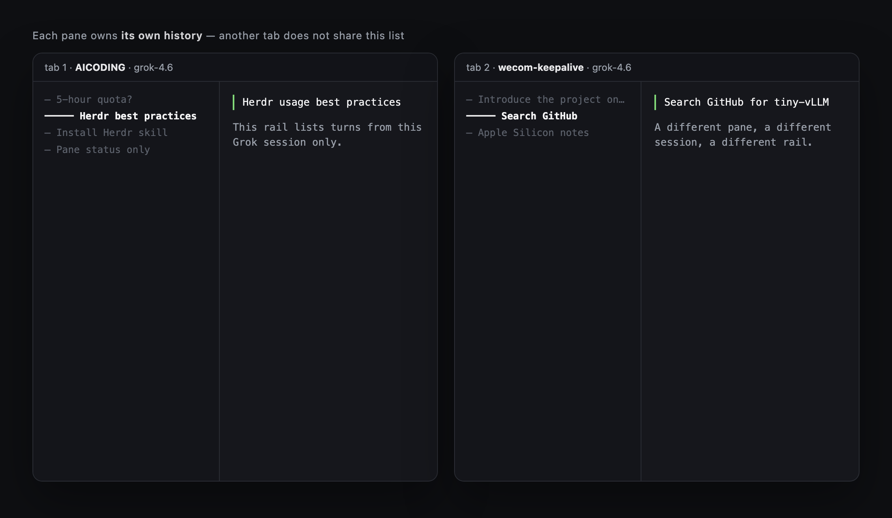

# Herdr Session History

A compact conversation-history rail for [Herdr](https://herdr.dev). Each agent pane gets its own list of **turns in the current session**. Selecting a row jumps the live Grok scrollback to that user prompt.

This is a community plugin, not part of Herdr core.

## Screenshots

<p align="center">
  
</p>

One small row per turn in the current pane. Selecting a row opens a preview card.

<p align="center">
  
</p>

Click or press up/down: the live Grok pane jumps to that user prompt (`Tab`, then `Shift+Left` / `Shift+Right`).

<p align="center">
  
</p>

Each pane owns its own history. Another tab does not share the list.

## Install

Requires **Herdr 0.9+** and **Python 3**.

```sh
herdr plugin install yafeishi/herdr-session-history
```

Bind a key (optional):

```toml
[[keys.command]]
key = "prefix+shift+h"
type = "plugin_action"
command = "herdr-session-history.open"
description = "open session history"
```

Reload config: `herdr server reload-config`.

Local checkout:

```sh
git clone https://github.com/yafeishi/herdr-session-history.git
herdr plugin link ./herdr-session-history
```

## Use

Focus an agent pane, then `prefix+shift+h` (or run `herdr plugin action invoke herdr-session-history.open`).

The rail binds to **that pane only**. Another pane or tab needs its own rail.

| Key | Action |
| --- | --- |
| `↑` `↓` / `j` `k` / click | Jump among this chat's turns; Grok scrollback follows (`Tab`, then `Shift+←/→`) |
| `/` | Search within this chat |
| `r` | Reload |
| `q` / `esc` | Close this pane's rail |

Jump is skipped while the bound agent is `working`.

## Agent support

| Agent | Turn list | Jump in the live TUI |
| --- | --- | --- |
| Grok | Yes (`chat_history.jsonl`) | Yes |
| Claude Code | Yes (session jsonl) | Best-effort, same keys |
| Codex | Not yet | Keys are sent; not guaranteed |
| Agy | Not yet | No |

## License

[MIT](LICENSE)
